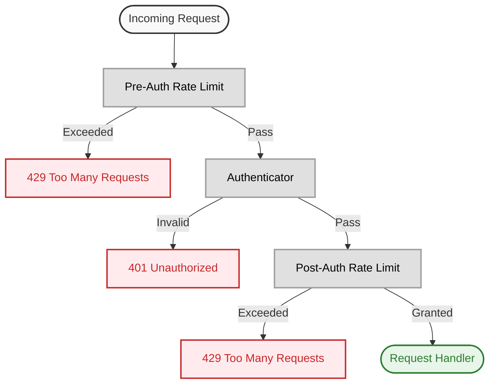

# rpcauth

This repository defines Protobuf options that allow you to declare authentication and rate limiting
policies directly in your Protobuf service or method definitions.

Security requirements live **alongside your API**, making them clear and maintainable.

- GitHub Repository:
  [github.com/protolayer/rpcauth-proto](https://github.com/protolayer/rpcauth-proto)
- Protobuf definitions: [buf.build/protolayer/rpcauth](https://buf.build/protolayer/rpcauth)

Enforce these policies in your [Connect](https://connectrpc.com/) (or [gRPC](https://grpc.io/))
services using language-specific SDKs:

- [protolayer/rpcauth-go](https://github.com/protolayer/rpcauth-go) (Go)
- .. more to come

## Features

- 🔐 Authentication: Define who can access your services and methods
- 🚦 Rate Limiting: Protect your services from abuse with configurable rate limiting strategies
- 🔒 Field Privacy: Control field-level visibility for sensitive data
- 🔌 Modular Design: Use only the components you need
- 🔧 Framework Agnostic: Works with both [Connect](https://connectrpc.com/) and
  [gRPC](https://grpc.io/)



## Usage

### 1. Import the module (buf.yaml)

```yaml
deps:
  - buf.build/protolayer/rpcauth
```

Run `buf dep update` to fetch the module and update your `buf.lock` file.

Only one file to import:

```protobuf
import "rpcauth/auth.proto";
```

### 2. Define security policies in your `.proto` files

In this example, the entire `UserService` requires authentication by default. Some methods override
this rule with `PUBLIC` to allow unauthenticated access.

The `User` message also demonstrates field-level privacy with a redacted email field.

```protobuf
syntax = "proto3";

package api.v1;

import "rpcauth/auth.proto";

service UserService {
  // Unless overridden by a method-level rule, all methods in this service require authentication.
  option (rpcauth.service).auth = REQUIRED;

  rpc GetUser(GetUserRequest) returns (GetUserResponse);

  rpc SearchUsers(SearchUsersRequest) returns (SearchUsersResponse) {
    // Public endpoint, no authentication required. But global rate limiting is enforced.
    option (rpcauth.method).auth = PUBLIC;
    option (rpcauth.method).rate = {
      key: GLOBAL
      leaky_bucket: {
        burst_capacity: 5
        allowed_requests: 25
        time_window_seconds: 60 // 25 requests per minute
      }
    };
  }
}

message User {
  string id = 1;
  string username = 2;
  string email = 3 [(rpcauth.field).privacy = REDACT];
}
```

### 3. Generate code like normal

Nothing changes in your code generation process. Enforcement of these policies is done at runtime
using the SDK, see next step.

### 4. Use the SDK to enforce policies

This is where things get interesting. The SDK provides a set of pluggable components that you can
use to enforce the policies defined in your Protobuf files.

```go
import (
    "github.com/protolayer/rpcauth-go"
)

// Create auth interceptor with your implementations or use the built-in ones.
authInterceptor := rpcauth.NewConnectInterceptor(
    rpcauth.WithAuthenticator(yourAuthImpl),
    rpcauth.WithRateLimiter(yourRateLimiter),
)

// Use with your Connect handlers
mux := http.NewServeMux()
mux.Handle(userv1connect.NewUserServiceHandler(
    &UserServiceServer{},
    connect.WithInterceptors(authInterceptor), // Add the interceptor
))
```

## Key Concepts

### Authentication (who are you?)

Authentication rules can be defined at both service and method levels. **Method-level rules take
precedence** over service-level rules.

Auth:

- `PUBLIC`: No authentication required
- `REQUIRED`: Authentication required

Example:

```protobuf
option (rpcauth.service).auth = REQUIRED;

option (rpcauth.service).auth = PUBLIC;
```

### Rate Limiting (how often can you do it?)

Controls request frequency using configurable rate limiting rules.

Supports multiple limit key types:

- `IP`: Limit by client IP address
- `USER`: Limit by authenticated user
- `API_KEY`: Limit by API key identifier
- `GLOBAL`: Global limit across all requests

Algorithms:

- Leaky Bucket
  - `burst_capacity` - Maximum burst size
  - `allowed_requests` - Number of allowed requests
  - `time_window_seconds` - Time window in seconds

Example:

```protobuf
option (rpcauth.method).rate = {
  key: GLOBAL
  leaky_bucket: {
    burst_capacity: 5
    allowed_requests: 25
    time_window_seconds: 60 // 25 requests per minute
  }
};
```

### Privacy Controls

Controls field-level visibility in responses.

- `VISIBLE`: Field is not sensitive
- `OMIT`: Remove field from response
- `REDACT`: Replace field with placeholder value

Example:

```protobuf
// Redact email field with a placeholder value for unauthenticated users.
string email = 3 [(rpcauth.field).privacy = REDACT];

// Hide the address field from all responses for unauthenticated users.
string address = 3 [(rpcauth.field).privacy = OMIT];
```

## License

This project is licensed under the MIT License - see the [LICENSE](LICENSE) file for details.

## FAQ

Why the name protolayer?

I'm trying to avoid adding more projects under my personal GitHub account. So an organization was
created to host this project and it's called `protolayer`.
